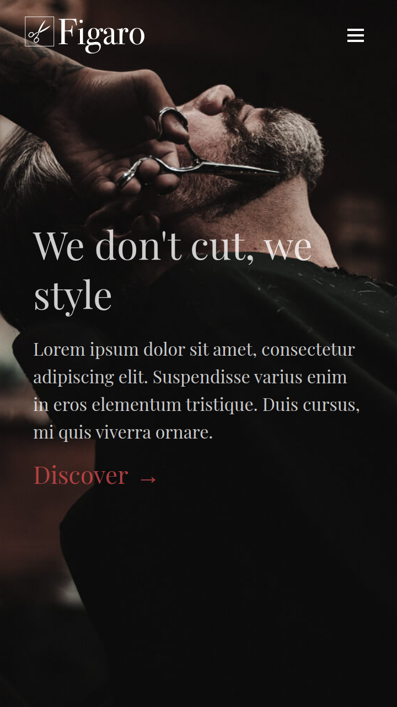
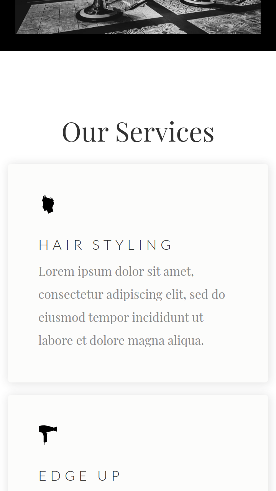
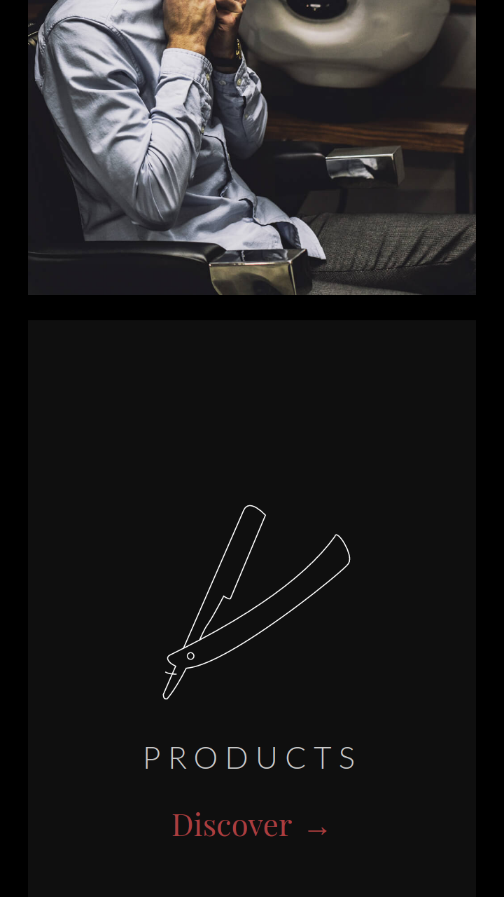
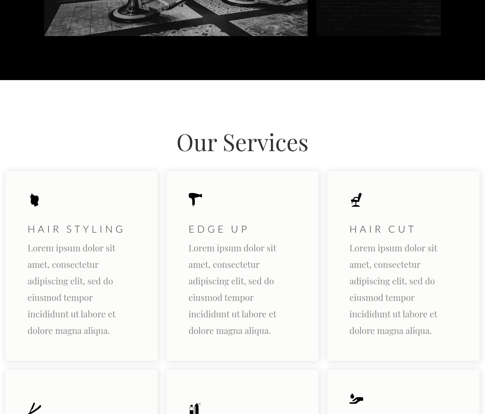
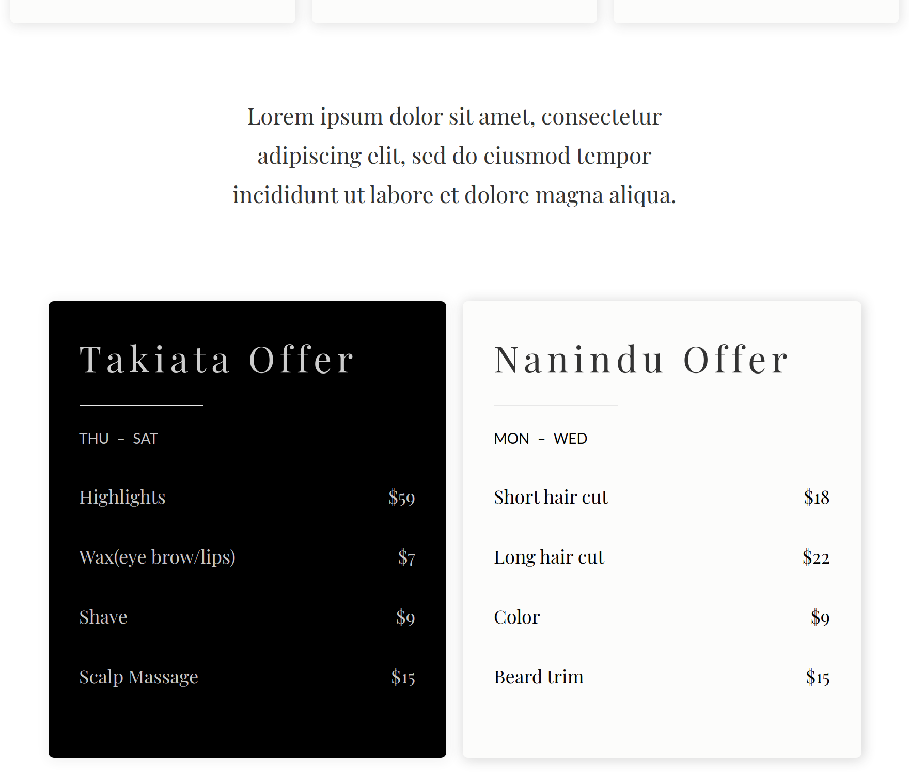
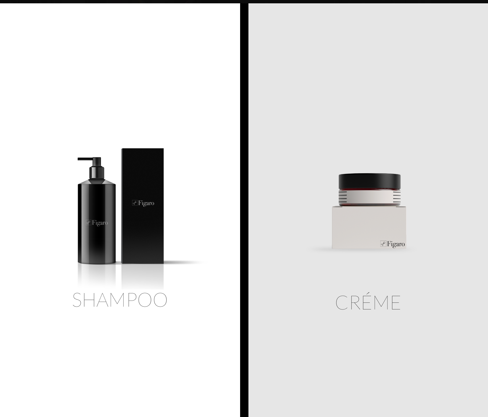

# Figaro

#### Description:

See live:
[Figaro](https://loretta-arineva.github.io/Figaro/) 

A hair salon websute, built with React, JavaScript/JSX, and SCSS.

## Project Status

### Current
Adding styles for larger devices.

### Next steps:
Adding footer links.
Adding hamburger menu.
Adding Functional menu for larger devices.
Adding component animations.

#### Note:

This project is currently in development.

## Project Screen Shots

#### Preview:   

## Installation and Setup Instructions

#### Example:  

Clone down this repository. You will need `node` and `npm` installed globally on your machine.  

Installation:

`npm install`  

To Start Server:

`npm start`  

To Visit App:

`localhost:3000`  

## Reflection

  - This is a side project to practice my skills.
  - I am building this project to implement a better react folder structure.
  - So far I have not encountered any issues or challenges. I am looking foward to testing some more SASS folder structures to see what works best for me.
  - Tools used:
      - This is my first project using SCSS and I LOVE IT. It makes everything so much easier to structure. The project was built much faster and it's easier to adjust styles. I've built many plain HTML + CSS + vanilla JS projects and finding the React + SCSS combo has changed my life and increased the speed at which I can now create projects.

#### Example:  

I have spent a total of 10 hours building this project and meant to reinforce my SCSS skills.

One of the goals for this application is to implement Context API since Redux is a bit crumbersome for a small application like this one. I tend to do things the other way around, learning the hard way first and then the easy way. Hence why I built a big project with the MERN stack and Redux and learning all 4 tools on the go. This threw me straight in the fire and helped me understand more complex concepts before I start from the basics. It's a bit like knowing the end of a book before you read it, without ruining your experience of it.

My goal is to focus more on React for the next several months and unfold its secrets and tricks.

# Getting Started with Create React App

This project was bootstrapped with [Create React App](https://github.com/facebook/create-react-app).

### `npm run build`

Builds the app for production to the `build` folder.\
It correctly bundles React in production mode and optimizes the build for the best performance.

The build is minified and the filenames include the hashes.\
Your app is ready to be deployed!

See the section about [deployment](https://facebook.github.io/create-react-app/docs/deployment) for more information.

## Credit 
Used an already existing website design that you can see here: [Figaro](https://preview.webflow.com/preview/figaro-salon?utm_source=figaro-salon&preview=fdbcf03085213b64857b9edc4a91a025)